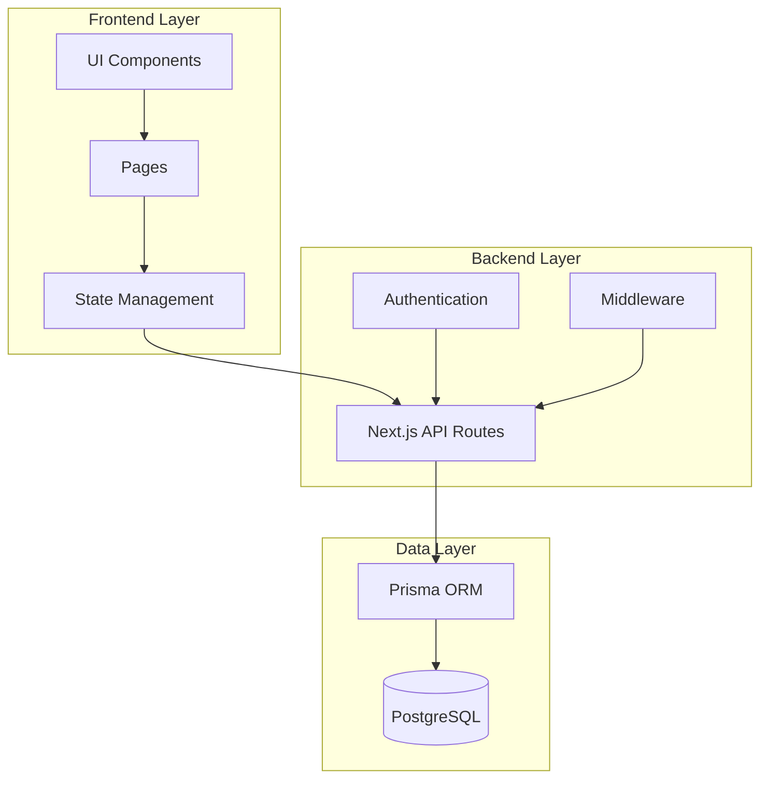
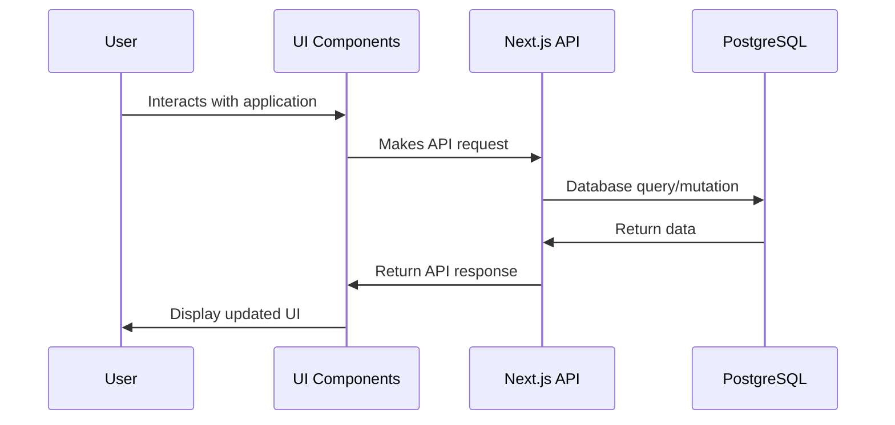
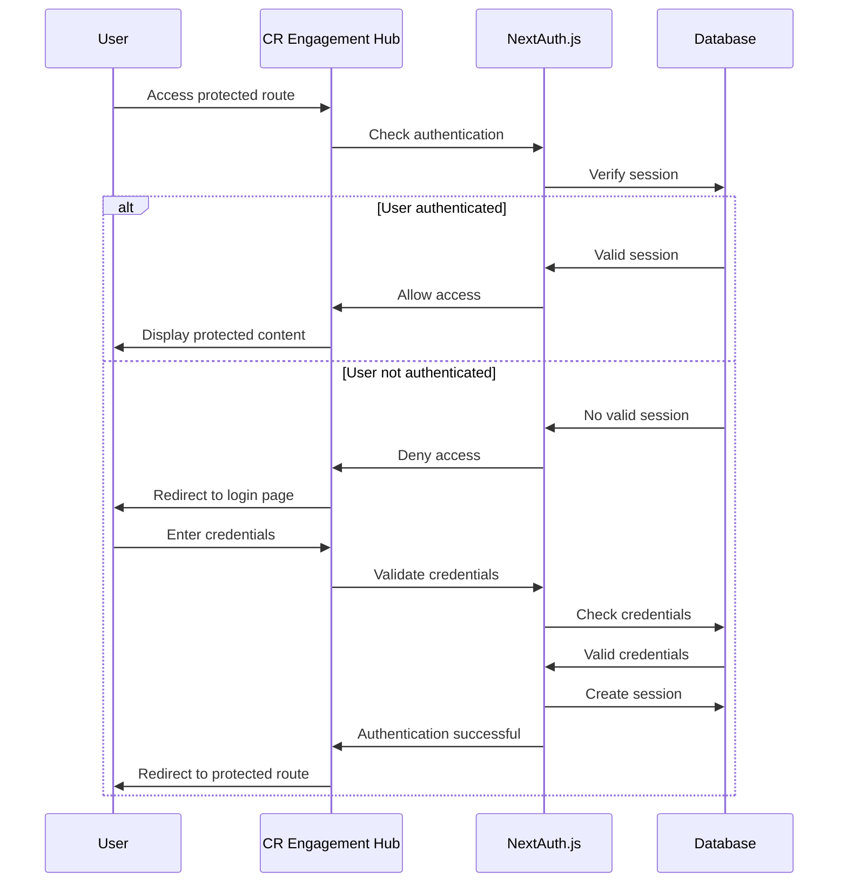
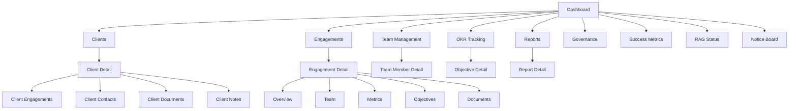

# CR Engagement Hub - Solution Design

This document outlines the architectural design of the CR Engagement Hub application.

## System Architecture

## Component Architecture

```mermaid
graph TD
    subgraph "Core Components"
        Layout[Layout]
        Card[Card]
        Button[Button]
        Badge[Badge]
        ProgressBar[ProgressBar]
        StatusBadge[StatusBadge]
    end

    subgraph "Feature Components"
        SuccessMetrics[Success Metrics Card]
        EnhancedObjective[Enhanced Objective Card]
        StatusTracker[RAG Status Tracker]
        NoticeBoard[Notice Board]
        MeetingAgenda[Meeting Agenda Builder]
        StakeholderMapping[Stakeholder Mapping Table]
        MeetingType[Meeting Type Selector]
    end

    subgraph "Pages"
        Dashboard[Dashboard]
        Clients[Clients]
        ClientDetail[Client Detail]
        Engagements[Engagements]
        EngagementDetail[Engagement Detail]
        OKRs[OKRs]
        Team[Team]
        Reports[Reports]
    end

    Layout --> Pages
    Card --> FeatureComponents
    Button --> FeatureComponents
    Badge --> FeatureComponents
    ProgressBar --> FeatureComponents
    StatusBadge --> FeatureComponents
    
    SuccessMetrics --> EngagementDetail
    EnhancedObjective --> OKRs
    EnhancedObjective --> EngagementDetail
    StatusTracker --> EngagementDetail
    NoticeBoard --> Dashboard
    MeetingAgenda --> EngagementDetail
    StakeholderMapping --> ClientDetail
    MeetingType --> EngagementDetail
```

## Data Flow

## Authentication Flow

## Page Navigation Structure

