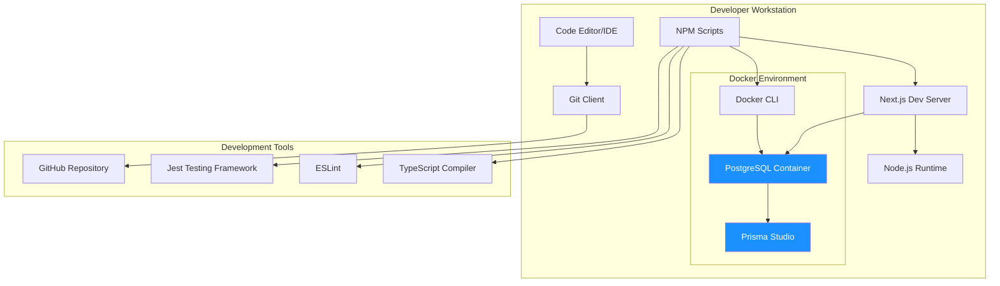
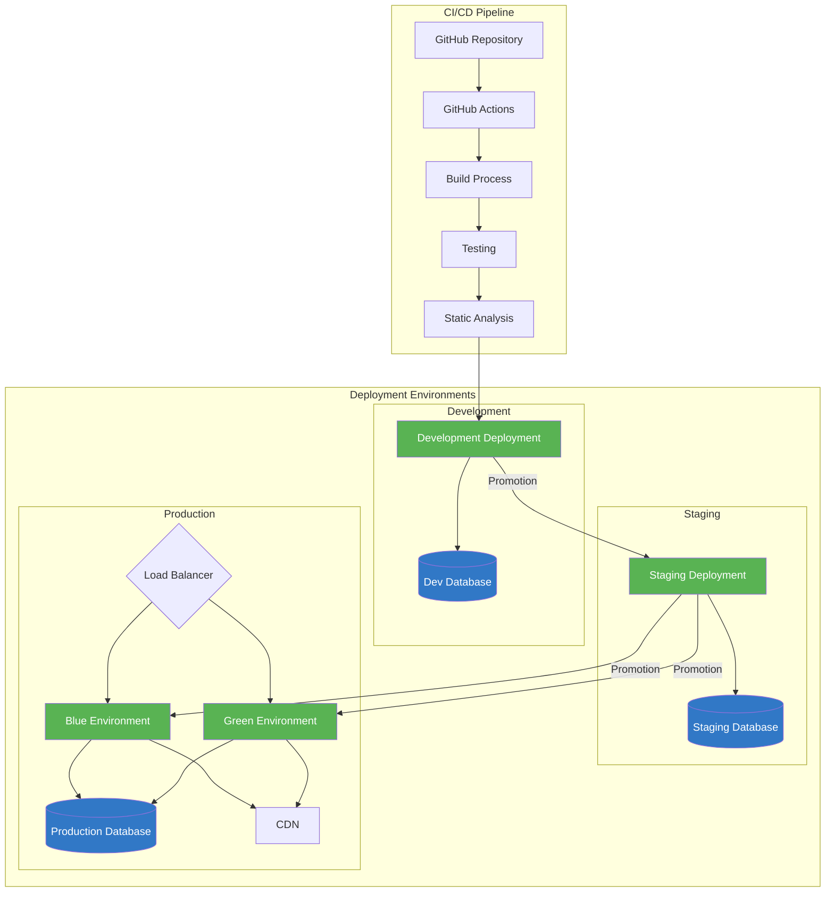
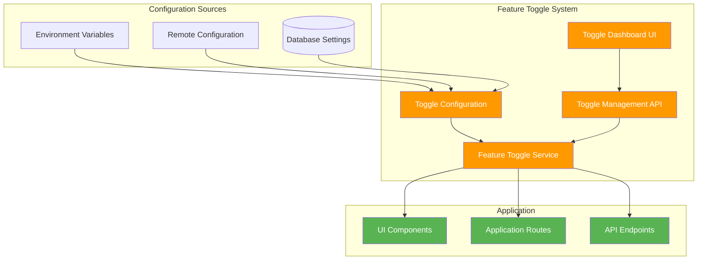
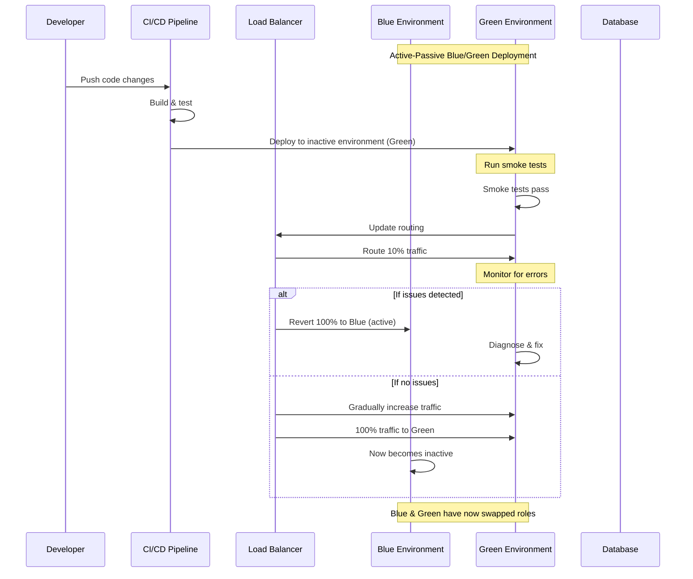
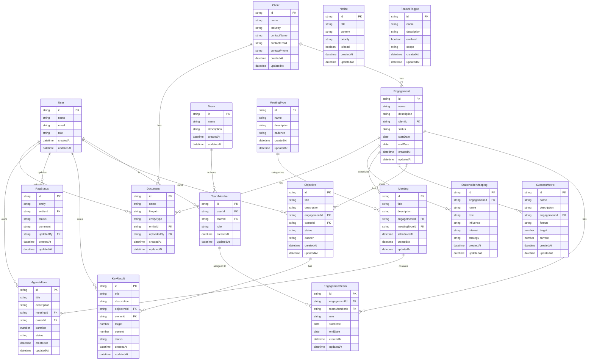

# CR Engagement Hub - Solution Design

This document outlines the architectural design of the CR Engagement Hub application.

## System Architecture

## Local Development Infrastructure

## Deployment Pipeline

## Feature Toggle Architecture

## Rollback Strategy

## Database Schema

## Component Architecture

## Data Flow

## Authentication Flow

## Page Navigation Structure

